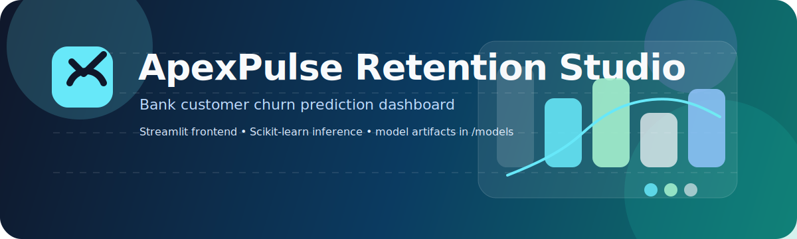

# ApexPulse Retention Studio



ApexPulse Retention Studio is a bank customer churn prediction project built around a Streamlit dashboard and a pre-trained scikit-learn model pipeline. It predicts whether a customer is likely to churn and returns a risk score, decision outcome, and suggested retention action.

The project uses the classic bank churn dataset, trains and compares multiple models, and packages the best-performing model together with preprocessing artifacts so the app can make predictions immediately.

---

## Features

- ML-based bank customer churn prediction
- 3 models trained and compared: Logistic Regression, Decision Tree, Random Forest
- Instant churn probability with low-risk / high-risk classification
- Visual risk meter and compact customer summary
- Action recommendations based on the prediction result
- Streamlit interface backed by saved model artifacts
- Dataset-driven workflow using the 10,000-row Churn_Modelling.csv file
- Reproducible notebook pipeline for preprocessing, training, and evaluation

---

## How It Works

This section explains the system from input to prediction.

### End-to-End Flow

1. The user opens the Streamlit app in `app.py`.
2. The app loads the serialized model, scaler, and label encoders from `models/`.
3. The user enters a customer profile in the left panel.
4. The app converts categorical values with the label encoders.
5. Numeric and encoded features are assembled in the same order used during training.
6. The scaler transforms the feature vector.
7. The trained model returns a churn probability and a class prediction.
8. The UI converts the output into a readable score, summary card, and recommended actions.

### Why Each Part Exists

- `app.py` handles the UI and runtime inference.
- `ApexPulse_Retention_Studio.ipynb` contains the training workflow and model comparison.
- `Churn_Modelling.csv` is the source dataset.
- `models/best_model.pkl` stores the selected classifier.
- `models/scaler.pkl` stores the fitted feature scaler.
- `models/le_geo.pkl` and `models/le_gen.pkl` store the fitted label encoders.
- `models/feature_names.pkl` guarantees the inference input column order matches training.

### Runtime Prediction Logic

- `CreditScore`, `Age`, `Tenure`, `Balance`, `NumOfProducts`, and `EstimatedSalary` are taken as numeric inputs.
- `Geography` and `Gender` are converted to numeric values using label encoders.
- `HasCrCard` and `IsActiveMember` are turned into binary flags.
- The values are passed into a `pandas.DataFrame` with the exact training feature order.
- The scaler normalizes the input.
- The model predicts both the churn class and the churn probability.

### 1️⃣ Dataset

**Churn_Modelling.csv** — 10,000 bank customers across France, Germany, and Spain

| Feature | Description |
|---|---|
| CreditScore | Customer credit score (300–850) |
| Geography | Country (France / Germany / Spain) |
| Gender | Male / Female |
| Age | Customer age |
| Tenure | Years with the bank (0–10) |
| Balance | Account balance ($) |
| NumOfProducts | Banking products held (1–4) |
| HasCrCard | Has a credit card? (Yes/No) |
| IsActiveMember | Active account member? (Yes/No) |
| EstimatedSalary | Annual salary ($) |
| Exited | **Target** — Churned (1) / Stayed (0) |

---

### 2️⃣ Data Processing (Notebook)

- Dropped irrelevant columns → `RowNumber`, `CustomerId`, `Surname`
- Checked for missing values and duplicates
- Label encoding for categorical features → `Geography`, `Gender`
- Feature scaling → `StandardScaler`
- Train-test split → 80/20, stratified by target

### 2.1 Training Pipeline Details

- The notebook prepares the dataset before training any model.
- The target column is `Exited`, where `1` means churn and `0` means retention.
- Categorical fields are encoded into numeric values because scikit-learn estimators require numeric inputs.
- Scaling is applied so the models receive features on a comparable range.
- The train/test split preserves the class distribution so evaluation is fair.

---

### 3️⃣ EDA Performed

- Churn distribution (Stayed vs Churned)
- Churn rate by Geography (Germany highest)
- Age vs Churn boxplot
- Correlation heatmap across all numeric features

### 3.1 What the EDA Shows

- Geography is a strong behavioral signal, especially Germany.
- Age and tenure help separate stable customers from higher-risk customers.
- Balance and activity status appear more informative than salary alone.
- The project uses this analysis to justify the final model choice and the dashboard narrative.

---

### 4️⃣ ML Models

- **3 Models Trained** → Logistic Regression, Decision Tree, Random Forest
- **Evaluation** → Accuracy, Precision, Recall, F1-Score, ROC-AUC
- **Best Model** → Random Forest (Accuracy: 86.6% | ROC-AUC: 84.7%)
- **Saved as** → `models/best_model.pkl` + `models/scaler.pkl` + encoders

### 4.1 Why Random Forest Won

- Logistic Regression is simple and fast, but it underfits some of the nonlinear churn patterns.
- Decision Tree captures nonlinear patterns but can overfit easily.
- Random Forest balances variance and bias better by averaging multiple trees.
- In this project it produced the best overall accuracy and ROC-AUC tradeoff.

---

## Model Results

| Model | Accuracy | Churn Recall | ROC-AUC |
|---|---|---|---|
| **Random Forest** | **86.6%** | **46%** | **84.7%** |
| Logistic Regression | 81.5% | 18% | — |
| Decision Tree | 78.4% | 52% | — |

> Random Forest selected as best model — highest accuracy with balanced precision/recall tradeoff.

---

## Key Findings

- **Germany** has significantly higher churn rate than France and Spain
- **Older customers** (40–60) churn more than younger ones
- Customers with **only 1 product** are at highest churn risk
- **Inactive members** are far more likely to exit
- **Account balance** is a stronger churn signal than salary

## System Architecture

The project has four main layers.

| Layer | Responsibility |
|---|---|
| Data layer | `Churn_Modelling.csv` provides the raw customer records |
| Training layer | The notebook cleans the data, builds features, trains models, and exports artifacts |
| Model layer | Pickled scaler, encoders, and classifier support repeatable inference |
| Presentation layer | `app.py` renders the dashboard and translates model output into business language |

### What Happens When the User Clicks Predict

1. Streamlit collects the selected customer values.
2. The app converts the values to the expected encoded format.
3. A one-row DataFrame is created.
4. The scaler transforms the row.
5. The model computes churn probability.
6. The app formats the result into the summary card, risk meter, and recommended actions.

### Design Choices

- Streamlit was used because it makes model demos fast to build and easy to run.
- Pickle was used because it keeps the trained model and preprocessing objects together for inference.
- Pandas is used to preserve feature names and input order.
- scikit-learn is used for the full machine learning workflow.

---

## Tech Stack

| Tool | Purpose |
|---|---|
| Python | Core language for training and inference |
| Pandas | Tabular data handling and feature assembly |
| NumPy | Numeric operations used by the ML workflow |
| Matplotlib | Plots used during analysis in the notebook |
| Seaborn | Statistical visualizations for churn exploration |
| scikit-learn | Encoding, scaling, modeling, and metrics |
| Pickle | Serialization of trained artifacts |
| Streamlit | Interactive dashboard and prediction UI |
| Jupyter Notebook | Training, EDA, and experimentation environment |

### Tech Stack Deep Dive

- Python is the main orchestration layer.
- Pandas creates the one-row inference table so the app can send features in a controlled format.
- NumPy supports the numeric computations inside the ML stack.
- Matplotlib and Seaborn are used for the notebook visuals that explain churn patterns.
- scikit-learn provides the preprocessing and model training primitives.
- Pickle stores the trained objects so the dashboard can run without retraining every time.
- Streamlit turns the model into a usable browser application.
- Jupyter Notebook is the experimentation space used to build and validate the pipeline before deployment.

---

## Project Structure
```
bank-churn-prediction/
│
├── app.py                              ← Streamlit dashboard and inference app
├── ApexPulse_Retention_Studio.ipynb      ← Full ML pipeline notebook
├── Churn_Modelling.csv                 ← Raw dataset
│
├── models/
│   ├── best_model.pkl                  ← Trained Random Forest model
│   ├── scaler.pkl                      ← StandardScaler
│   ├── le_geo.pkl                      ← Geography LabelEncoder
│   ├── le_gen.pkl                      ← Gender LabelEncoder
│   └── feature_names.pkl               ← Feature name list
│
├── requirements.txt
└── README.md
```

---

## Installation & Setup

### 1️⃣ Clone the repo
```bash
git clone <your-repo-url>
cd bank-churn-prediction
```

### 2️⃣ Create virtual environment
```bash
python -m venv venv
```

### 3️⃣ Activate environment

**Windows**
```bash
venv\Scripts\activate
```

**Mac/Linux**
```bash
source venv/bin/activate
```

### 4️⃣ Install requirements
```bash
pip install -r requirements.txt
```

### 5️⃣ Run the notebook first (to generate model files)
```bash
jupyter notebook "ApexPulse_Retention_Studio.ipynb"
```

### 6️⃣ Run the Streamlit app
```bash
streamlit run app.py
```

---

## requirements.txt
```
streamlit
pandas
numpy
scikit-learn
matplotlib
seaborn
```

---

## Dataset

Available on Kaggle: https://www.kaggle.com/datasets/radheshyamkollipara/bank-customer-churn
---

## Live Demo

Add your deployed Streamlit URL here.

## Interview Questions

These are the most likely questions someone may ask about this project in an interview.

1. Why did you choose Random Forest as the final model?
2. What features had the strongest impact on churn?
3. Why did you use label encoding instead of one-hot encoding here?
4. Why is feature scaling needed even though tree models do not require it?
5. How did you handle class imbalance, if at all?
6. Why is churn prediction important for a bank?
7. What is the difference between churn probability and churn class?
8. How does the Streamlit app load the trained model at runtime?
9. What happens if the order of features during inference is different from training?
10. Why did Germany show a higher churn rate than France and Spain?
11. Which metric matters most in this problem: accuracy, recall, precision, or ROC-AUC?
12. How would you improve the model if you had more time?
13. What are the limitations of using a dataset like this in production?
14. Why did you store preprocessing objects along with the model?
15. How would you explain this project to a non-technical bank manager?

## Short Interview Answers

- The model is not just predicting churn; it is producing a business decision path.
- The pipeline is reusable because the same preprocessing is saved and replayed during inference.
- The dashboard is designed to support intervention, not just reporting.
- The most important engineering detail is feature consistency between training and production.

## Notes

- The UI has been intentionally left as-is in the current version.
- No license text was added or removed because no explicit license file was present in the workspace.
